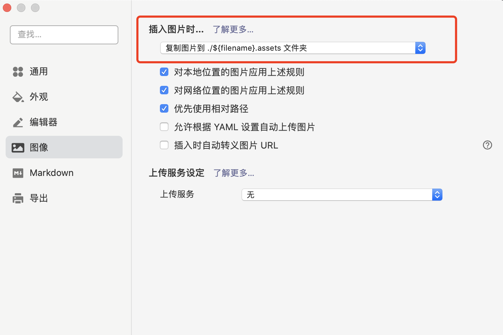

# MdHelper
markdown 文档上传七牛云，替换url助手

## 1、项目背景
该项目最初由python进行编写，后为便于使用分享，重新使用go进行编写。

- 在日常Typora编写md博客时，由于需要将文章发布在各个平台上，为便于发布，需要对md文件中的图片上传到图床(七牛云)。

- 发布完毕之后，最终需要保存到github的page博客中进行备份。

- 为了避免图床中的图片被其他网站大量引用造成费用，在图片上传完毕之后，需要把图床中的图片删除。

## 2、功能
- [ ] 上传md文档中的全部文件
- [ ] Typora式图片-->github博客式图片，自动提交到github
- [ ] 后置功能：清空七牛云中的资源

## 3、使用手册

使用Typora编写文档时建议选用如下配置，可以实现文章的独立性。

